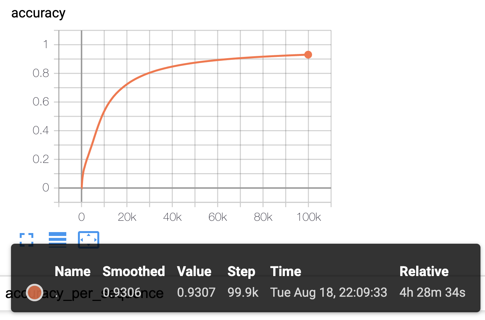
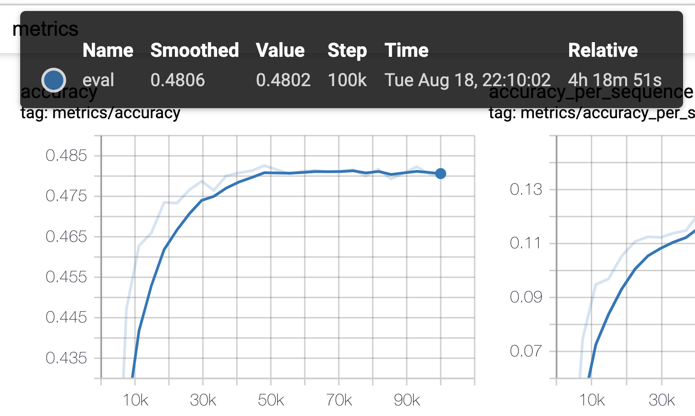

# chatbot-transformer

Transformer를 기본으로 한 질의응답 (입력: 질문, 출력: 답변) seq2seq 모델

- 학습/평가 데이터 출처: https://github.com/songys/Chatbot_data
- 데이터 가공 참조: https://github.com/changwookjun/ChatBot_seq2seq_extend

## Requirements

- Tensorflow-estimator
- konlpy
  - prediction 시 필요

## Branches

### master

감정 데이터를 사용하지 않은 데이터로 transformer를 학습/평가

### add-emot

데이터셋에서 제공하는 감정 데이터를 입력 (질문) 시퀀스 맨 앞에 추가하여 학습/평가
- max_step: 100000
- batch_size: 64
- learning_rate: 2
- vocab_limit: 5000
- max_length: 25
- num_hidden_layers: 2 # n Transformer encoder and n Transformer decoder
- num_heads: 8
- hidden_size: 128 
- filter_size: 512 # Inner layer dimension in the feedforward network (128->512->128)
- train_size: 0.67 # train data portion

 
 
 

### cond-mask

입력 또는 출력 시퀀스의 일부를 랜덤 개수 제거하여 학습 페어로 사용함 (입력과 출력이 다양해 질 수 있도록 하기 위해)
- 기존 문장 길이를 L이라 할때, 제거 할 토큰 개수는 uniform(0,L/3) 에서 랜덤 추출되며, 그에 따른 제거 위치도 랜덤으로 결정됨
